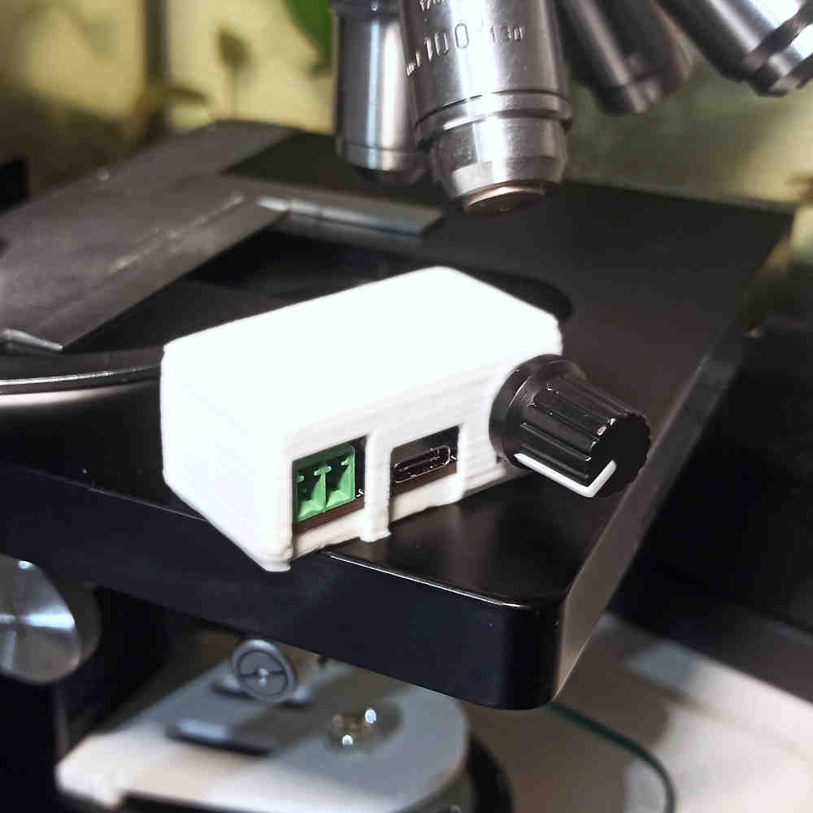
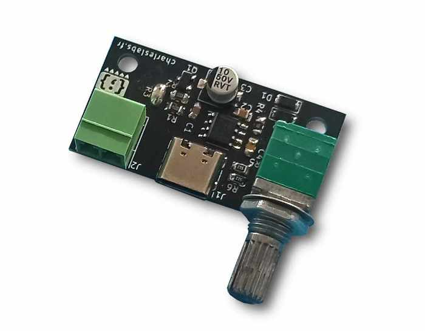

# Microscope LED Driver circuit

This circuit drives a 1W or 3W LED to convert old optical microscopes from light bulb/halogen lamp to LED ligthing.

It is powered from a USB type C port and is fully dimmable. It may be used with a USB power bank, for instance.

LEDs are considerably more efficient (i.e. less heat), have a longer lifespan and have a better color accuracy than bulbs. My circuit has a high PWM frequency to avoid flickering and rolling bands effect in photographs.

## Features

| Specification  | Value                                     |
|:---------------|:------------------------------------------|
| Power input    | 5V @ 1A max. (USB type C)                 |
| PWM frequency  | >8KHz                                     |
| Controls       | Combined knob dimming (0-100%) and ON/OFF |
| Estimated cost | About $10                                 |

## Build instructions

Gerber files are ready to upload to your prefered PCB manufacturer. The components are generic and should be available at most electronic components distributors. I personally use JLCPCB and LCSC.

Hand soldering this board is easy. I included an "interactive BOM" to help with part placement.

The only additional required parts are a 1W or 3W "star" LED with a 30° lens to pre-focus the light into the condenser. Thank to this lens, a 1W LED is sufficient. You can choose your favorite color temperature.

I also included a 3D-printable case for the circuit. Print at 0.2mm layer height, no support required.

*Although I designed a PCB, this circuit could be build on a piece of stripboard or even breadboard.*

## Principle of operation

This circuit uses a classic 555 variable duty cycle astable multivibrator configuration.

The potentiometer adjusts the charge and discharge rate of the TRIG capacitor. The frequency of the carrier depend on the RC constant of those parts.

## License

All files in this repository are released under CC-BY license.